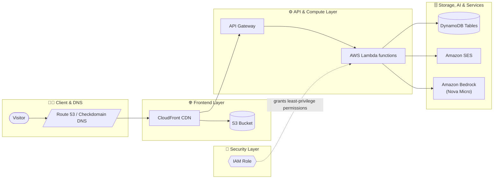

# Sara's AWS Serverless Projects Portfolio

Welcome to the repository for my AWS Cloud Portfolio! This is a full-stack, multi-page serverless web application built to showcase my cloud engineering work: a growing catalogue of full-stack and AI-powered projects, backed by a real AWS architecture running behind the scenes — visitor analytics, generative AI features, and serverless infrastructure all included. Alongside the projects, the site also hosts a collection of interactive arcade games (with an installable PWA version) for anyone who wants to take a break and play.

🌐 **Live Demo:** [https://www.sarasiahatgar.com/](https://www.sarasiahatgar.com/)

---

## Features & Multi-Page Layout

### Home (`index.html`)
* **Serverless Visitor Ticket:** A punch-card style visitor counter, live-updated via AWS Lambda and DynamoDB.
* **Featured Games:** Quick-play access to **Nibble** and **Gorilla** right on the landing page.
* **Architecture Overview:** A full rundown of the AWS and third-party services powering the site.
* Links onward to the Projects Hub and the full Arcade.

### Projects Hub (`projects-hub.html`)
A running catalogue of full-stack experiments and AI tools, each with its own build notes and tech stack:
* **AI-Companion** *(Live)* — a serverless AI storytelling companion that analyzes user stories via Amazon Nova Micro and reads its feedback back with Microsoft Azure Speech.
* **Scrum Sandbox** *(Live)* — an Agile Scrum simulator with a Kanban board, sprint health tracking, and Nova Micro–powered backlog auditing via AWS Bedrock and Lambda.
* **Music Lab** *(Beta)* — a Cello & Piano composition studio built on abcjs and the Web Audio API, with PDF/WAV export.
* **Kitchen Byte** *(In Development)* — an AI meal-prep and zero-waste menu planner using the Google Gemini and Places APIs.

### 🕹️ Arcade Games (`arcade-games.html`)
Some Nostalgic arcade games live together:

**Breakout · Connect Four · Dot Eater · GuessWord · Gorilla · Mastermind · Memory Match · Minesweeper · Nibble · Pond Hopper · Raindrop · Set · Tic-Tac-Toe · VikingII**

* **AI-Powered Games:** Tic-Tac-Toe, Connect Four, and (AI-)Gorilla are all powered by Amazon Bedrock (Nova Micro). If you're offline, they gracefully fall back to a built-in local AI opponent so the games stay playable.
* **Installable PWA Arcade:** The whole arcade can be installed as a Progressive Web App for offline play — install the full collection, or just grab your favorite individual game to keep on your device. (My favorite is Set game. A cool brain teaser game)
* **Suggestion Box:** A spot for visitors to submit game ideas — currently closed while the dev desk catches up on the backlog!

### About Me (`about-me.html`)
A bio covering my background, technical skills, and a few of the hobbies that keep me sane outside of code.

### Contact Me (`contact-me.html`)
A contact form (math captcha included, wandering cat cursor optional) for getting in touch.

---

## AWS Cloud Architecture & Backend Services

This project is built using a modern, serverless architecture on Amazon Web Services, alongside a few complementary third-party APIs.

### Architecture Diagram

*The editable source diagram (built in [diagrams.net](https://app.diagrams.net/)) lives at [`/docs/AWS-architecture.drawio`](./docs/AWS-architecture.drawio) if you'd like to open and tweak it directly.*

### Services Used

1. **Amazon S3:** Hosts the static front-end web files (HTML, CSS, JavaScript, and game assets).
2. **AWS CloudFront:** CDN providing global edge caching, fast distribution, and low latency.
3. **AWS Certificate Manager (ACM):** Provisions and manages the SSL/TLS certificate for secure HTTPS communication.
4. **Amazon Route 53 / Checkdomain DNS:** Manages custom domain routing, records, and redirects to the CloudFront distribution.
5. **Amazon API Gateway:** Managed REST API endpoint routing requests securely between the browser and backend.
6. **AWS Lambda:** Serverless Python functions handling visitor counter increments, suggestion box submissions, and high-score logic.
7. **Amazon DynamoDB:** Fully managed NoSQL database storing visitor analytics, suggestions, and high-score records.
8. **Amazon Bedrock (Nova Micro):** Powers AI-driven responses and dynamic elements across the AI-Gorilla trash talk, AI-Companion, Scrum Sandbox auditing, and the offline-fallback opponents in Tic-Tac-Toe and Connect Four.
9. **Google Gemini API:** Drives generative AI features and intelligent assistant workflows in Kitchen Byte.
10. **Google Places API:** Handles location lookups and geographic context for real-world integrations.
11. **Microsoft Azure Speech:** Synthesizes natural-sounding voice audio for AI-generated text responses.
12. **Amazon SES (Simple Email Service):** Handles automated transactional email notifications.
13. **AWS CloudWatch:** Monitors application logs, Lambda performance, and operational health metrics.
14. **AWS CloudShell:** Browser-based command line for deployment scripts and resource management.
15. **JavaScript (ES6+) Modules:** Powers modular component logic and dynamic UI rendering.
16. **HTML5 Canvas & CSS3:** Renders interactive arcade mechanics, fluid layouts, and visual styling.
17. **Asynchronous REST / Fetch API:** Manages client-server communication with the AWS API Gateway endpoints.

---

## Connect With Me

* **LinkedIn:** [Sara Siahatgar](https://www.linkedin.com/in/sara-siahatgar-b6a0151b5/)
* **Portfolio Website:** [sarasiahatgar.com](https://www.sarasiahatgar.com/)
